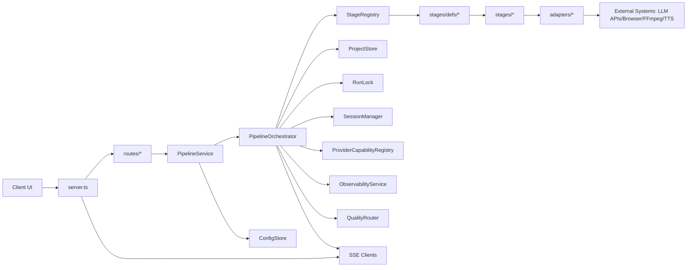
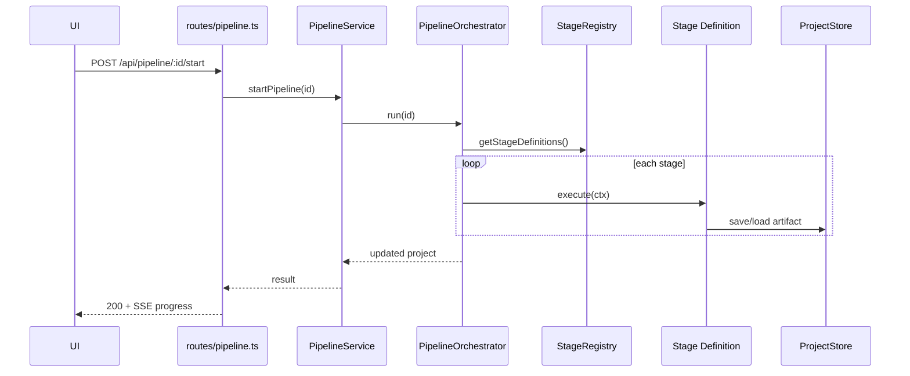

# 后端评审文档：接口与模块依赖图

本文用于设计评审、架构走查与跨模块协作对齐。

## 1. 目标与边界

- 目标：明确 ai-video-main/src 后端接口边界、调用链、依赖方向与风险点
- 评审重点：
  - 路由是否只依赖服务门面（而非内部编排细节）
  - 编排层是否通过注册机制扩展（而非硬编码）
  - 并发与持久化是否满足生产约束

## 2. 对外接口总览

### 2.1 HTTP 入口

- 入口文件：server.ts
- 主要路由集合：
  - routes/workbench.ts
  - routes/pipeline.ts（pipelineRoutesV2）
  - routes/setup.ts

### 2.2 SSE 事件接口

- 路径：GET /api/events
- 事件来源：
  - Workbench 事件
  - Pipeline 事件（通过 PipelineService 广播）
- 作用：前端实时显示任务进度、阶段日志、状态变更

## 3. 核心依赖图（评审主图）

## 4. 模块职责与接口边界

### 4.1 server.ts

职责：
- 创建运行时依赖（Workbench、PipelineService、ConfigStore 等）
- 组装路由
- 处理 SSE、CORS、鉴权与健康检查

边界要求：
- 不包含 pipeline 业务逻辑
- 不直接操作 orchestrator 内部状态

### 4.2 routes/*

职责：
- 参数解析、状态码规范化、错误映射
- 调用 PipelineService 或 Workbench 对外方法

边界要求：
- 不跨层调用 pipeline/stages
- 不直接修改持久化文件

### 4.3 PipelineService

职责：
- 作为应用服务门面，提供稳定 API 给路由层
- 屏蔽 orchestrator 的内部演化

边界要求：
- 对路由公开明确方法，不泄漏底层内部对象

### 4.4 PipelineOrchestrator

职责：
- 负责全流程编排与阶段推进
- 统一失败处理、重试、暂停/恢复、事件广播

边界要求：
- 阶段执行顺序来自 StageRegistry
- 不在 run() 中回退到巨型硬编码流程

### 4.5 StageRegistry + stages/defs

职责：
- 声明式注册阶段定义
- 提供阶段顺序单一真相（single source of truth）

边界要求：
- 任何新增阶段必须通过 defs 注册
- 禁止在多个文件重复维护阶段顺序

### 4.6 ProjectStore + RunLock

职责：
- ProjectStore：原子写盘、artifact 管理、项目 CRUD
- RunLock：项目级并发互斥

边界要求：
- 同一 projectId 同时仅允许一个 run
- 任何中间产物应可独立恢复

## 5. 关键调用链（以 start 为例）

## 6. 评审检查清单

- 路由层：
  - [ ] 仅依赖 PipelineService / Workbench
  - [ ] 错误响应结构一致（code/message/details）
- 服务层：
  - [ ] 未暴露内部可变对象
  - [ ] 方法命名和语义与路由一致
- 编排层：
  - [ ] 阶段顺序来自 registry
  - [ ] 失败可定位到 stage + artifact
- 并发与持久化：
  - [ ] RunLock 保护关键入口
  - [ ] ProjectStore 保持原子写
- 可观测性：
  - [ ] 关键事件都有日志与 SSE
  - [ ] 阶段耗时、失败原因可追溯

## 7. 高风险点与建议

- 外部依赖波动（浏览器页面结构、第三方 API）
  - 建议：适配层超时、重试、降级与错误码分层
- 阶段耦合累积
  - 建议：严格通过 StageRunContext 传递依赖，减少隐式共享状态
- 回归成本增加
  - 建议：补齐 pipelineService、qualityRouter、adapters 的针对性测试
