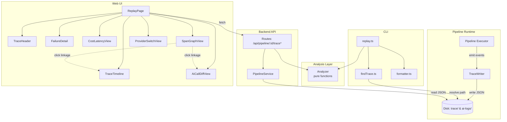
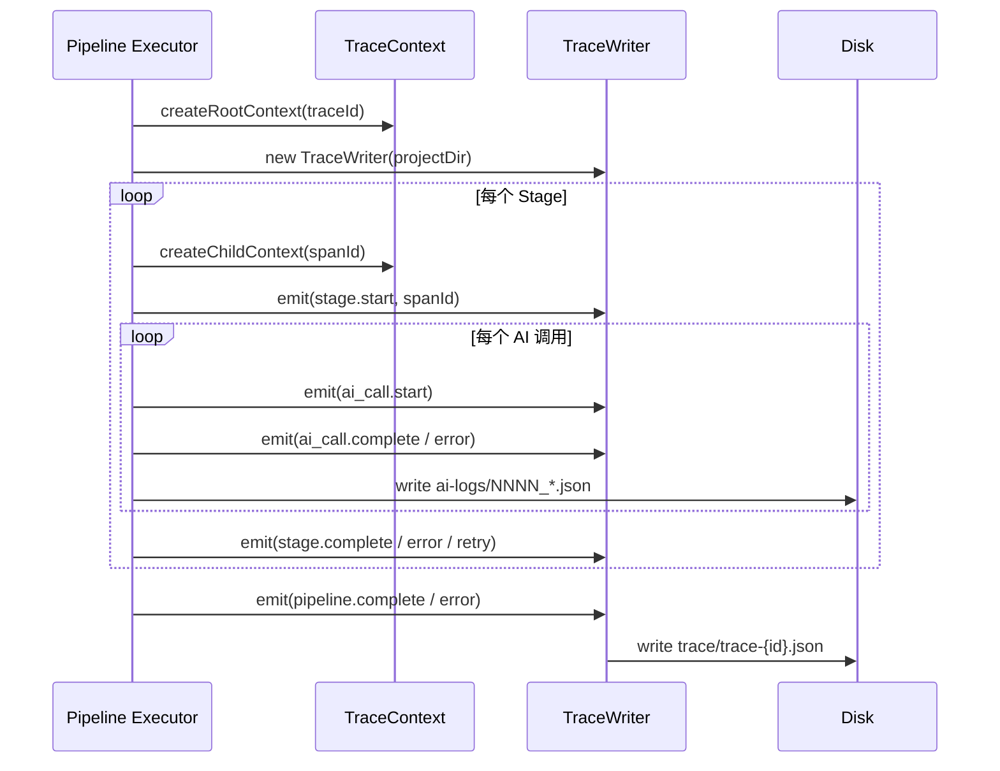
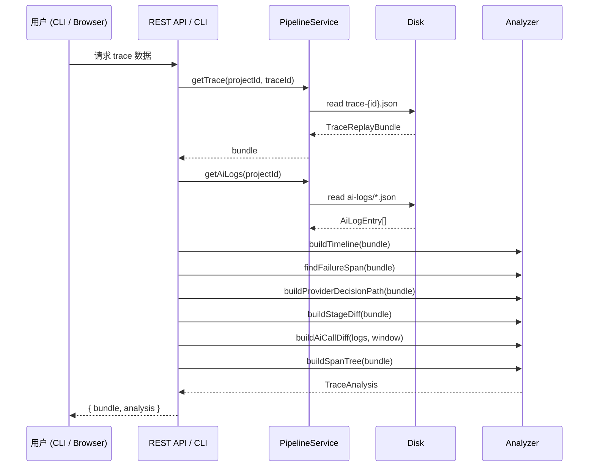
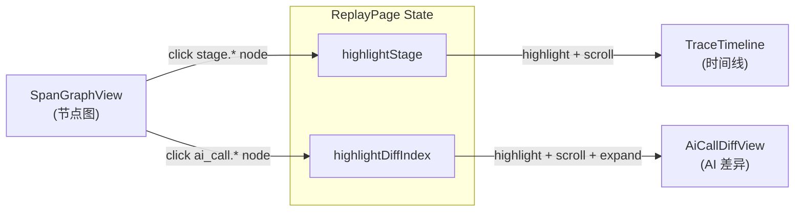
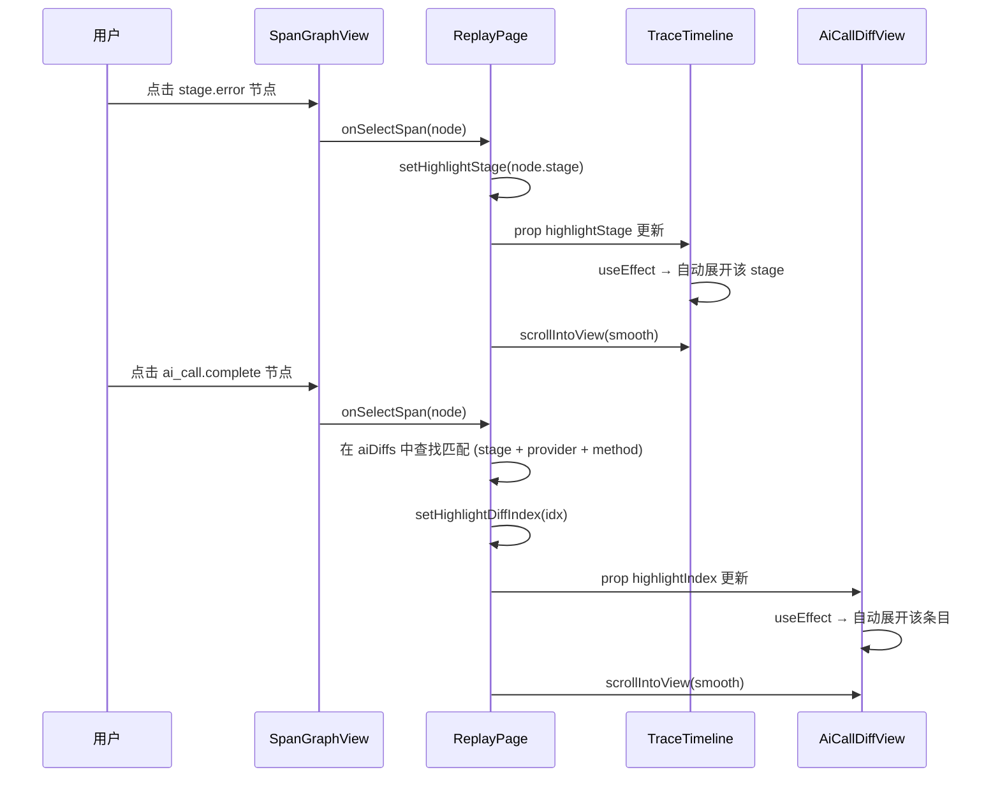

# Trace Replay — 技术设计文档

> 流水线执行追踪 · 回放 · 诊断系统

---

## 1. 概述

Trace Replay 是一套面向 AI 视频流水线的 **事后诊断系统**。每次流水线执行时，系统自动写入结构化的 trace bundle（JSON），记录所有阶段、AI 调用、重试、错误和费用信息。开发者和运维人员可通过 **CLI**、**REST API** 或 **Web UI** 三种方式对历史执行进行回放分析。

### 设计目标

| 目标 | 说明 |
|------|------|
| **可观测性** | 完整记录流水线执行路径，包括 AI 调用入参/出参、Provider 切换、重试链 |
| **故障定位** | 一键定位失败阶段，展示错误传播路径与重试决策 |
| **性能分析** | 每阶段耗时瀑布图、AI 调用延迟分布、费用统计 |
| **零侵入** | 分析器为纯函数，不触碰任何 I/O；仅在写入和加载时与磁盘交互 |

---

## 2. 系统架构

### 2.1 总体架构 (ASCII)

```
┌─────────────────────────────────────────────────────────────────────┐
│                        ai-video monorepo                            │
│                                                                     │
│  ┌──────────┐  ┌──────────────────┐  ┌────────────────────────────┐ │
│  │          │  │   src/pipeline/   │  │        ui/ (React)         │ │
│  │  CLI     │  │                  │  │                            │ │
│  │          │  │  ┌────────────┐  │  │  ReplayPage                │ │
│  │ replay   │─▶│  │ Analyzer   │  │◀─│    ├─ TraceHeader          │ │
│  │ findTrace│  │  │ (pure fn)  │  │  │    ├─ TraceTimeline ◀──┐   │ │
│  │ formatter│  │  └─────▲──────┘  │  │    ├─ FailureDetail    │   │ │
│  │          │  │        │         │  │    ├─ CostLatencyView  │   │ │
│  └──────────┘  │  ┌─────┴──────┐  │  │    ├─ AiCallDiffView ◀┤   │ │
│                │  │ TraceWriter │  │  │    ├─ SpanGraphView ──┘   │ │
│                │  │ (I/O layer) │  │  │    └─ ProviderSwitchView  │ │
│                │  └─────▲──────┘  │  │                            │ │
│                │        │         │  └────────────▲───────────────┘ │
│                │  ┌─────┴──────┐  │               │                │
│                │  │ Pipeline   │  │         ┌─────┴──────┐         │
│                │  │ Executor   │  │         │ REST API   │         │
│                │  └────────────┘  │         │ /api/pipe  │         │
│                │                  │         │ line/:id/  │         │
│                └──────────────────┘         │ trace(s)   │         │
│                                             └─────▲──────┘         │
│                                                   │                │
│                                        ┌──────────┴──────────┐     │
│                                        │  PipelineService    │     │
│                                        │  (getTrace, etc.)   │     │
│                                        └─────────────────────┘     │
└─────────────────────────────────────────────────────────────────────┘
                                  │
                                  ▼
                    ┌──────────────────────────┐
                    │   Disk (per-project)     │
                    │                          │
                    │   {project}/             │
                    │   ├── trace/             │
                    │   │   └── trace-{id}.json│
                    │   └── ai-logs/           │
                    │       └── 0001_*.json    │
                    └──────────────────────────┘
```

### 2.2 架构 (Mermaid)



---

## 3. 数据流

### 3.1 写入阶段 (Pipeline → Disk)



### 3.2 读取分析 (CLI / API → Analyzer)



### 3.3 Trace Bundle 结构

```
TraceReplayBundle
├── traceId: string
├── projectId: string
├── startedAt / endedAt: ISO 8601
├── outcome: 'completed' | 'error' | 'aborted'
├── durationMs: number
├── totals: { stages, aiCalls, totalCostUsd }
└── events: TraceEvent[]
     ├── kind: 'pipeline.start' | 'stage.start' | 'ai_call.start' | ...
     ├── spanId / parentSpanId
     ├── ts: ISO 8601
     ├── stage / provider / model / method
     ├── durationMs / costUsd
     └── failure?: { category, code, message, retriable, stack }
```

---

## 4. 分析器函数

所有分析函数为 **纯函数**（无 I/O、无副作用），输入数据结构，输出分析结果：

| 函数 | 输入 | 输出 | 说明 |
|------|------|------|------|
| `buildTimeline` | `TraceReplayBundle` | `TimelineEntry[]` | 按时间排序的事件列表，计算各事件相对起始的偏移 |
| `findFailureSpan` | `TraceReplayBundle` | `FailureSpan \| null` | 定位失败阶段，提取重试链和关联 AI 调用 |
| `buildProviderDecisionPath` | `TraceReplayBundle` | `ProviderDecision[]` | AI 调用的 Provider 选择路径，标记 fallback |
| `buildStageDiff` | `TraceReplayBundle` | `StageDiff[]` | 各阶段状态摘要：耗时、重试、费用、AI 调用次数 |
| `buildAiCallDiff` | `AiLogEntry[], window?` | `AiCallDiff[]` | AI 调用输入/输出差异分析，含 changeRatio 和预览 |
| `buildSpanTree` | `TraceReplayBundle` | `SpanNode[]` | 基于 spanId/parentSpanId 构建父子层级树 |

### 核心类型

```typescript
// AI 调用差异
interface AiCallDiff {
  seq: string;
  stage: string; method: string; provider: string; model?: string;
  durationMs: number; status: 'ok' | 'error';
  inputText: string;   // prompt 文本化
  outputText: string;  // response 文本化
  errorText?: string;
  diffSummary: {
    prefixMatchChars: number;      // 输入/输出共同前缀长度
    changedBeforeChars: number;    // 输入变化字符数
    changedAfterChars: number;     // 输出变化字符数
    changeRatio: number;           // 0-1 变化率
  };
  preview: { before: string; after: string };
}

// Span 树节点
interface SpanNode {
  spanId: string; parentSpanId?: string;
  kind: string; stage?: string;
  provider?: string; model?: string; method?: string;
  ts: string; tsMs: number; durationMs?: number;
  status: 'ok' | 'error' | 'info';
  children: SpanNode[];
}
```

---

## 5. UI 三视图

Web UI 的 ReplayPage 从单一 API 响应 `{ bundle, analysis }` 获取全部数据，渲染 **7 个子组件**。以下将核心三视图详细解释。

### 5.1 视图总览

```
┌──────────────────────────────────────────────────────┐
│  TraceHeader    追踪概要 / 选择器                       │
├──────────────────────────────────────────────────────┤
│  FailureDetail  失败诊断 (仅在 outcome=error 时出现)     │
├──────────────────────────────────────────────────────┤
│                                                      │
│  TraceTimeline  ← highlightStage                     │
│  ┌──────────────────────────────────────────────┐    │
│  │  ◉ 能力评估  ████░░░░░░░░░░░░░░░░  2.1s     │    │
│  │  ◉ 脚本生成  ░░░░████████░░░░░░░░  5.3s     │    │
│  │  ◉ 分镜设计  ░░░░░░░░░░░░████░░░░  3.2s     │    │
│  │  ✕ 视频生成  ░░░░░░░░░░░░░░░░████  12.7s    │    │
│  └──────────────────────────────────────────────┘    │
│                                                      │
├──────────────────────────────────────────────────────┤
│  CostLatencyView  费用与延迟                           │
├──────────────────────────────────────────────────────┤
│                                                      │
│  AiCallDiffView  ← highlightDiffIndex                │
│  ┌──────────────────────────────────────────────┐    │
│  │  #1 ✓ 能力评估 · generateText · openai  1.2s │    │
│  │  ▸ 展开: 输入/输出文本 + 差异指标 + 预览       │    │
│  │  #2 ✓ 脚本生成 · generateText · claude  4.1s │    │
│  │  #3 ✕ 视频生成 · generateVideo · runway 8.3s │    │
│  └──────────────────────────────────────────────┘    │
│                                                      │
├──────────────────────────────────────────────────────┤
│                                                      │
│  SpanGraphView  → onSelectSpan                       │
│  ┌──────────────────────────────────────────────┐    │
│  │  ● 流水线开始                                 │    │
│  │  │                                            │    │
│  │  ├─ ● 阶段开始  CAPABILITY_ASSESSMENT         │    │
│  │  │  └─ ● AI 调用  openai · gpt-4     1.2s    │    │
│  │  │                                            │    │
│  │  ├─ ● 阶段开始  SCRIPT_GENERATION             │    │
│  │  │  └─ ● AI 完成  claude · sonnet    4.1s    │    │
│  │  │                                            │    │
│  │  ├─ ○ 阶段错误  VIDEO_GEN  ← error path      │    │  
│  │  │  └─ ○ AI 错误  runway · gen-3     8.3s    │    │
│  │  │                                            │    │
│  │  └─ ○ 流水线错误                               │    │
│  └──────────────────────────────────────────────┘    │
│                                                      │
├──────────────────────────────────────────────────────┤
│  ProviderSwitchView  Provider 选择路径                │
└──────────────────────────────────────────────────────┘
```

### 5.2 三核心视图交互 (Mermaid)



### 5.3 SpanGraphView 节点图详解

SpanGraphView 是核心的「图形化 Span 树」，从树根到叶节点渲染出层级节点：

```
节点卡片组成：
┌─────────────────────────────────────────────────┐
│  ▸  ●  AI 调用   SCRIPT_GEN   openai·gpt-4  ⊕  │
│  │  │    │          │              │          │  │
│  │  │    │          │              │        联动标记
│  │  │    │          │           provider·model pill
│  │  │    │        stage 名
│  │  │  kind 标签 (中文)
│  │  status dot (绿/红/蓝 + glow)
│  expand/collapse toggle
└─────────────────────────────────────────────────┘
```

**视觉特性：**

| 特性 | 实现 |
|------|------|
| 层级布局 | 递归 `NodeCard` + `pl-5` (20px) 缩进 |
| 树连接线 | absolute positioned divs: 垂直主干 + 水平分支 + 交汇点圆点 |
| 错误路径高亮 | `collectErrorPath` 从叶到根标记；红色边框 + 左 accent + 红色连接线 |
| 节点选择 | 蓝色 ring + 背景；`selectedId` state |
| 点击联动 | `stage.*` → scroll 到 TraceTimeline；`ai_call.*` → scroll 到 AiCallDiffView |
| 展开控制 | 「展开全部 / 折叠全部」按钮；默认展开前两层 + 错误路径 |
| Provider 标签 | 圆角 pill badge 显示 provider · model |

**错误路径算法：**
```typescript
// collectErrorPath: 深度优先，返回所有"通往错误节点"的 span ID 集合
function collectErrorPath(nodes: SpanNode[]): Set<string> {
  const ids = new Set<string>();
  function walk(n: SpanNode): boolean {
    const childHasErr = n.children.some(c => walk(c));
    if (n.status === 'error' || childHasErr) {
      ids.add(n.spanId);
      return true;
    }
    return false;
  }
  nodes.forEach(walk);
  return ids;
}
```

### 5.4 点击联动流程



---

## 6. CLI 接口

```bash
# 回放最近一次 trace（所有格式）
npm run replay -- <project-id>

# 指定 trace ID
npm run replay -- a1b2c3d4e5f6...

# 指定文件路径
npm run replay -- ./data/projects/xxx/trace/trace-abc.json

# 仅输出时间线
npm run replay -- <project-id> --format timeline

# JSON 机器可读输出
npm run replay -- <project-id> --json

# 列出所有可用 trace
npm run replay -- --list
```

**格式选项：** `summary` | `timeline` | `failure` | `providers` | `stages` | `all`

**退出码：** 错误/中止的 trace 返回 `exit 1`，成功返回 `exit 0`。

---

## 7. REST API

| 方法 | 路径 | 返回 |
|------|------|------|
| GET | `/api/pipeline/:id/traces` | `Array<{ traceId, startedAt, outcome, durationMs }>` |
| GET | `/api/pipeline/:id/trace` | `{ bundle, analysis }` — 最新 trace + 完整分析 |
| GET | `/api/pipeline/:id/traces/:traceId` | `{ bundle, analysis }` — 指定 trace + 完整分析 |
| GET | `/api/pipeline/:id/ai-logs` | `AiLogEntry[]` — 原始 AI 日志 |

`TraceAnalysis` 结构:
```typescript
interface TraceAnalysis {
  timeline: TimelineEntry[];
  failureSpan: FailureSpan | null;
  providerPath: ProviderDecision[];
  stageDiff: StageDiff[];
  aiDiffs: AiCallDiff[];
  spanTree: SpanNode[];
}
```

---

## 8. 文件清单

```
src/
├── pipeline/trace/
│   ├── analyzer.ts        # 6 个纯分析函数 + 类型定义
│   ├── formatter.ts       # 5 个 CLI 格式化函数
│   ├── index.ts           # barrel exports
│   ├── traceEvents.ts     # TraceEvent / TraceReplayBundle 类型
│   ├── traceContext.ts    # spanId/traceId 生成 + classifyError
│   ├── traceWriter.ts     # TraceWriter 类 (I/O)
│   └── __tests__/
│       └── analyzer.test.ts  # 27 个测试用例
├── cli/
│   ├── replay.ts          # CLI 入口
│   ├── findTrace.ts       # trace 发现逻辑
│   └── __tests__/
│       └── findTrace.test.ts  # 9 个测试用例
├── routes/
│   └── pipeline.ts        # 4 个 trace API 端点
└── pipeline/
    └── pipelineService.ts # 4 个 trace 服务方法

ui/src/
├── pages/
│   └── ReplayPage.tsx     # 页面容器 + 联动逻辑
├── components/replay/
│   ├── SpanGraphView.tsx  # 图形化 Span 节点树
│   ├── TraceTimeline.tsx  # 瀑布时间线
│   ├── AiCallDiffView.tsx # AI 输入/输出差异
│   ├── TraceHeader.tsx    # 追踪概要头部
│   ├── FailureDetail.tsx  # 失败诊断面板
│   ├── CostLatencyView.tsx# 费用与延迟
│   └── ProviderSwitchView.tsx # Provider 选择路径
├── api/
│   └── client.ts          # 4 个 trace API 方法
└── types.ts               # 前端类型定义
```

---

## 9. 测试覆盖

| 模块 | 文件 | 用例数 |
|------|------|--------|
| 分析器 | `analyzer.test.ts` | 27 (含 buildAiCallDiff×3, buildSpanTree×2) |
| Trace 查找 | `findTrace.test.ts` | 9 |
| **合计** | | **36** |

测试策略：
- 分析器：构造 mock bundle → 调用纯函数 → 断言返回结构
- Trace 查找：临时目录 + `DATA_DIR` 环境变量注入
- 格式化器：由 CLI 集成间接覆盖
- UI：依赖手动验证（未来可加 React Testing Library）

---

## 10. 后续规划

| 优先级 | 方向 | 说明 |
|--------|------|------|
| P1 | 可视 diff 渲染 | side-by-side 语法高亮 diff，取代纯文本 pre |
| P2 | API 集成测试 | 用 supertest 测试 trace 端口的完整链路 |
| P2 | 流水线持续 trace | 实时推送 trace events (SSE / WebSocket) |
| P3 | Trace 比对 | 两次执行的 side-by-side 对比 |
| P3 | 导出 | 将 trace 分析导出为 PDF / 分享链接 |
